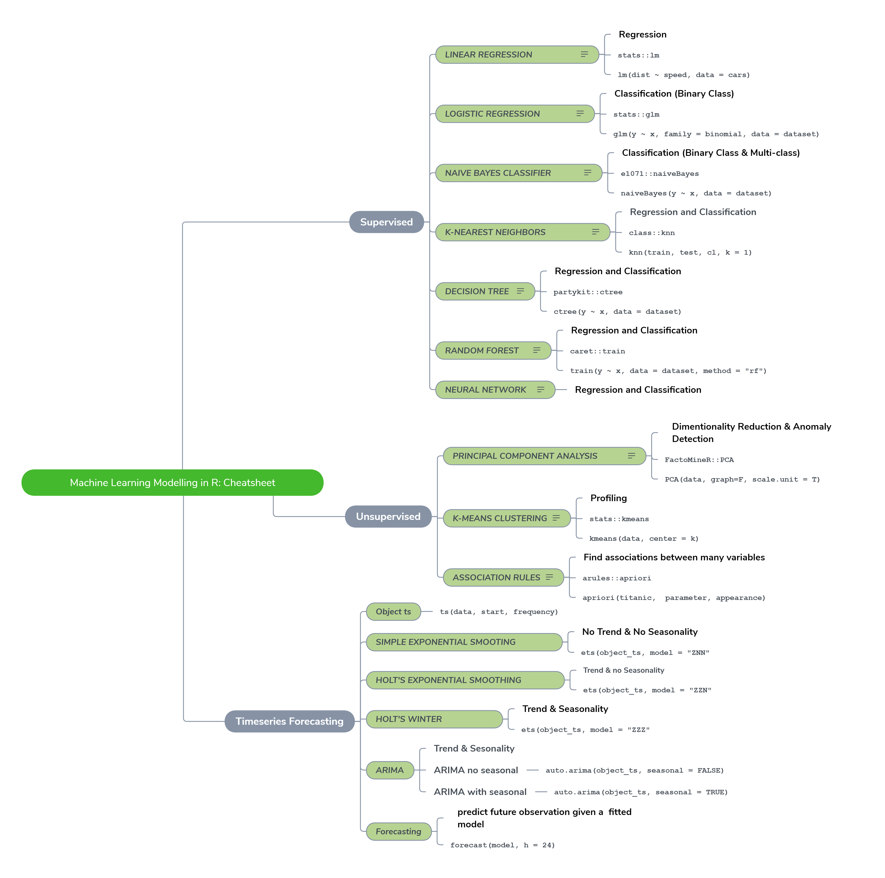

# Machine Learning Modelling in R: Cheatsheet

Is a cheat sheet to help determine what machine learning algorithms appropriate to use. Also for further improvement will be adding case examples for each machine learning method with R.

- [x] Regression cases
- [ ] Classification cases
- [ ] Timeseries cases




## Supervised

### Linear Regression

Model the linear relationship between dependent variable Y and one or more explanatory variables (or independent variables) denoted X

- Regression
- stats::lm
  
```
lm(dist ~ speed, data = cars)
```

### Logistic Regression

Used to predict a binary outcome (1 / 0, Yes / No, True / False) given a set of independent variables

- Classification (Binary Class)
- stats::glm

```
glm(y ~ x, family = binomial, data = dataset)
```

### Naive Bayes Classifier

A classification technique based on Bayes' Theorem with an assumption of independence among predictors. In simple terms, a Naive Bayes classifier assumes that presence of a particular featur in a class in unrelated to the presence of any other feature

- Classification (Binary Class & Multi-class)
- e1071::naiveBayes

```
naiveBayes(y ~ x, data = dataset)
```

### K-Nearest Neighbors

A non-parametric method used for classification and regression. In both cases, the input consist of the k closest training examples in the feature space. The output depends on whether k-NN is used for classification or regression

- Regression and Classification
- class::knn

```
knn(train, test, cl, k = 1)
```

### Decision Tree

The idea is to consecutively divide (branch) the training dataset based on the input features until an assignment criterion with respect to the target variable into a "data bucket" (leaf) is reached

- Regression and Classification
- partykit::ctree

```
ctree(y ~ x, data = dataset)
```

### Random Forest

An ensamble learning method for classification, regression and other tasks, that operate by constructing a multitude of decision trees at training time and outputting the class that is the mode of classes (classification) or mean prediction (regression)

- Regression and Classification
- caret::train

```
train(y ~ x, data = dataset, method = "rf")
```

### Neural Network

Neural networks are built from units called neuron. Neuron have one or more inputs, an activation function and an output. An NN model is built up by combining neuron in structured layers.

- Regression and Classification

## Unsupervised

### Principal Component Analysis

Principal component analysis (PCA) is a procedure for reducing the dimensionality of the variable space by representing it with a few orthogonal (uncorrelated) variables that capture most of its variability called principal component

- Dimentionality Reduction & Anomaly Detection
- FactoMineR::PCA

```
PCA(data, graph=F, scale.unit = T)
```

### k-Means Clustering

Aims at partitioning n observations into k clusters in which each observation belongs to the cluster with the nearest mean

- Profiling
- stats::kmeans

```
kmeans(data, center = k)
```

### Association Rules

This technique tries to understand the relationship or association between different items in a group. This association pattern takes the form of if - then with measures of support and confidence as a result.

- Find associations between many variables
- arules::apriori

```
apriori(titanic,  parameter, appearance)
```

## Timeseries Forecasting

### Object ts

```
ts(data, start, frequency)
```

### Simple Exponential Smooting

- No Trend & No Seasonality

```
ets(object_ts, model = "ZNN"
```

### Holt's Exponential Smoothing

- Trend & no Seasonality
  
```
ets(object_ts, model = "ZZN"
```

### Holt's winter

- Trend & Seasonality

```
ets(object_ts, model = "ZZZ"
```

### ARIMA

- Trend & Sesonality
- ARIMA no seasonal

```
auto.arima(object_ts, seasonal = FALSE)
```

- ARIMA with seasonal

```
auto.arima(object_ts, seasonal = TRUE)
```

### Forecasting

- predict future observation given a  fitted model

```
forecast(model, h = 24)
```

----

# :memo: Future Improvement

- Add an example case for each machine learning methods.

> For you who have ideas so this cheat sheet can be more useful, just open pull request with the improvements :grin: